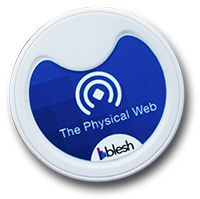

# URIBeacon check-in

A simple app that makes use of [physical web beacons](https://github.com/google/uribeacon) to make a convenient way of displaying a staff in/out board in an office without any user interaction.  Users wear or carry a small coin-battery powered bluetooth low energy beacon, which emits a URL once a second which can be detected at a range of around 10 metres.  The URL is the address of a semantic web representation of that person, eg:

```
HTTP/1.1 200 OK
Etag: "26-bf3632e463ecd614b8aafcf1df80c13f"
Date: Sun, 01 Mar 2015 11:51:42 GMT
Content-Type: application/json;charset=utf-8
Content-Length: 233

{
	"_id":"12ac9c3c2e6d03f2e49eec1be25332ce",
	"_rev":"26-bf3632e463ecd614b8aafcf1df80c13f",
	"type":"person",
	"displayName":"Andrew",
	"userName":"andrew.betts",
	"lastSeenLocation":"Andrew's Macbook",
	"lastSeenDate":"2015-03-01T11:35:05.357Z"
}
```

Fixed sensors mounted in the physical environment detect the beacons, and make an HTTP GET request to the advertised URL, fetching the current revision of the person's data.  The sensor then updates it with the sensor's location, and makes an HTTP PUT request to update the resource.

## Beacons

I purchased some pre-made beacons from [Blesh](https://www.blesh.com/physical-web/), but if you're more of a hacker than me I'm told they're not hard to build.  A guide and bill of materials is available on [Openbeacon](http://get.openbeacon.org/device.html).  The blesh beacons ship in plastic cases around the size of a ginger nut biscuit:



But a lot of that is actually empty space.  I removed all the cases since it was then easier to get to the battery and configure button.  To configure a beacon:

1. Install the "Physical Web" app from the iOS or Android app store
2. Make sure bluetooth is enabled on your phone
3. Activate the beacon (in my case, that meant removing a plastic tab that was preventing the battery from making contact)
4. Launch the app, and make sure it detects the beacon
5. Press the cog to enter setup mode
6. Press the button on the beacon
7. Wait for the app to read the current URL from the beacon (I found this would sometimes hang.  A restart of the beacon and the phone fixed it)
8. Enter a new URL.  The URL can only be at most approximately 17 characters, so use a URL shortening service like bit.ly.


## Sensors

Raspberry Pis make excellent sensors.  I used a [Raspberry Pi 1 Model B+](http://www.raspberrypi.org/products/model-b-plus/), with a Bluetooth 4 USB dongle like [this one](http://www.amazon.co.uk/Racksoy-Professional-Bluetooth-Dongle-Adapter/dp/B00KNPTHS8/ref=sr_1_1), and a [MicroSD card preloaded with NOOBS](http://www.amazon.co.uk/NOOBS-card-Raspberry-Pi-Model/dp/B00LMF3QSU/ref=sr_1_1?ie=UTF8&qid=1425212037&sr=8-1&keywords=noobs+8gb+sd+card).  Here's how I set it up:

### Install Raspbian

Connect a USB keyboard, ethernet cable, HDMI monitor, and NOOBS SD card to the Pi.  Now plug it in (you can either use any Micro USB power adapter, or tether the Pi to any convenient USB port using a Micro-USB to USB cable).  The Pi will boot to the NOOBS screen.  Choose Raspbian, press i to install it, and wait ages.

When it's done, you should get a screen with other install options, I skipped all those and pressed finish.  Then you get a shell prompt.  Type `ifconfig` to get the Pi's IP address.  Now connect to that IP from your computer with the username `pi` and password `raspberry`.

Assuming that works, you can now detach the keyboard and monitor from the Pi (if you're feeling confident), and continue setting it up over an SSH session.

### Install packages needed by bluetooth

```bash
sudo apt-get update
sudo apt-get install libdbus-1-dev libdbus-glib-1-dev libglib2.0-dev libical-dev libreadline-dev libudev-dev libusb-dev libbluetooth-dev make
```

### Install bluetooth stack

```bash
mkdir bluez
cd bluez
sudo wget www.kernel.org/pub/linux/bluetooth/bluez-5.28.tar.xz
xz -d bluez-5.28.tar.xz
tar xvf bluez-5.28.tar
cd bluez-5.28/
./configure --disable-systemd
make
sudo make install
sudo shutdown -h now
```

Now insert the USB dongly thing, power cycle and log back in.

### Put gatttool in the PATH

```
cd /usr/local/bin
sudo ln -s ~/bluez/bluez-5.28/attrib/gatttool
```

### Turn on the bluetooth device

```
cd ~/bluez/bluez-5.28
tools/hciconfig
sudo tools/hciconfig hci0 up
tools/hciconfig
```

### Scan for Low energy devices

```
sudo hcitool lescan
```

Should find the beacon

### Install NodeJS

```
cd ~
wget http://node-arm.herokuapp.com/node_latest_armhf.deb
sudo dpkg -i node_latest_armhf.deb
```

### Install and run the sensor app

```
cd ~
git clone git://github.com/triblondon/uribeacon-checkin.git
cd uribeacon-checkin
npm install
LOCATION_DESC="FT Labs office" node index.js
```

On the Pi you may need to run using `sudo` to give Node access to the bluetooth hardware.

## Server

The server can be anything that serves JSON and permits clients to perform GET and PUT operations, but a CouchDB database works pretty well.  I used [Cloudant](http://www.cloudant.com).  Set up a new database, allow public read/write (this ought to be authenticated, but it's only an in/out board).  Create a record for each person with at least `lastSeenLocation` and `lastSeenDate` on each record.  You can add whatever other fields you want, the sensor doesn't care and will not overwrite them.

Cloudant then provides an API URL for the document, which will look something like:

```
https:// {accountName} .cloudant.com/ {databaseName} / {docID}
```

### Reporting

If you're using Couch, you can report the current location of all people using a view.  This view code will return a list of people seen within the last day and their locations:

```javascript
function(doc) {
  if (doc.type === "person" && doc.displayName && Date.parse(doc.lastSeenDate) > (Date.now() - (60*60*24*1000))) {
    emit(doc.displayName, doc.lastSeenLocation);
  }
}
```

## Ideas

Future development ideas:

* Authentication
* UI to display the view
